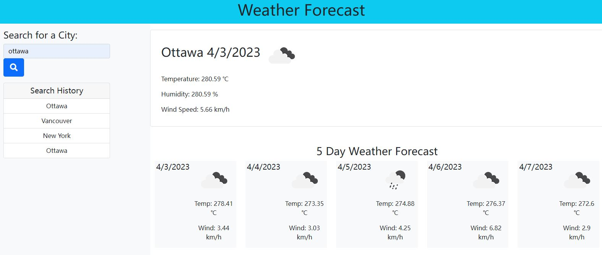

# uniqueish-weather-dashboard

## Description:

### This is a weather dashboard that use OpenWeatherMap Api data and display the current weather and a 5-day forcast of the searched location.

## Installation:

### N/A

## Usage:

### To use this application, enter location in the search bar and click the search button. The current weather and 5-day forcast will be displayed on the right. The history search are stored and shown on the left.

## Credits:

### OpenWeatherMap: https://openweathermap.org/

## License: MIT 

## Features:

### This weather dashboard shows the current weather and a 5-day forcast of the searched location, and history is save to localstorage. When the history buttons are clicked, the previously searched city weather forcast will be shown.

## Contributors:

### N/A
